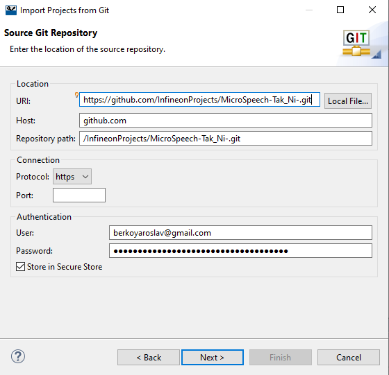
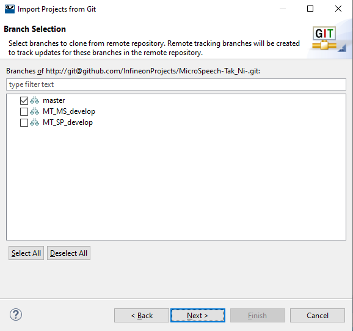
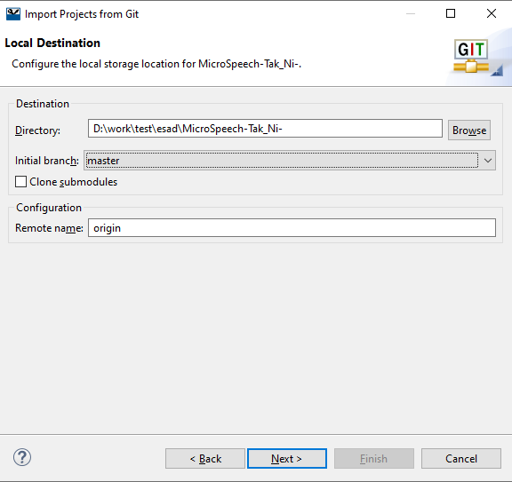
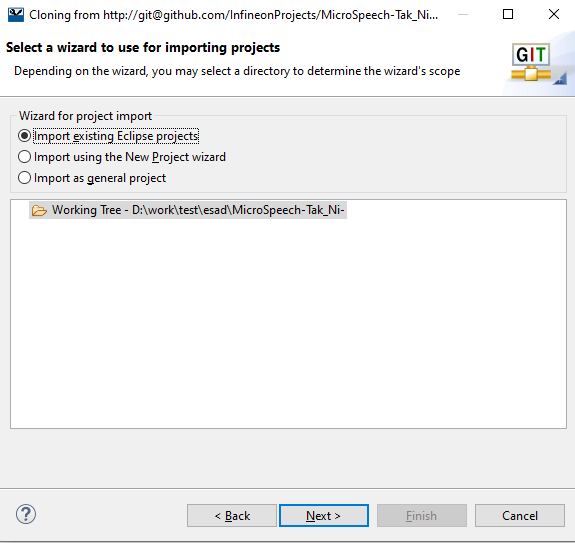
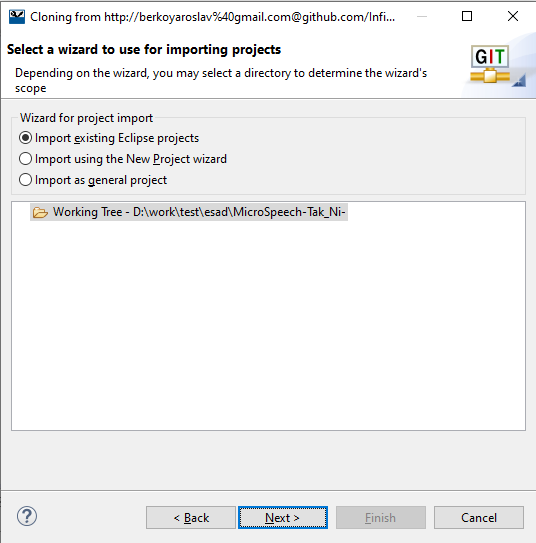
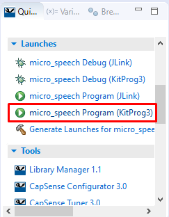

# PSoC 6 MCU: Spectrogram Printf

This code example demonstrates how to record sound (duration 2 sec ), make an FFT and output a spectrogram in short form.

- [ModusToolbox™ software](https://www.cypress.com/products/modustoolbox-software-environment) v2.1
- Programming Language: C, C++

## Supported Kits

- [PSoC 6 WiFi-BT Pioneer Kit](https://www.cypress.com/CY8CKIT-062-WiFi-BT) (CY8CKIT-062-WiFi-BT) - Default target
- [PSoC 6 Wi-Fi BT Prototyping Kit](https://www.cypress.com/CY8CPROTO-062-4343W) (CY8CPROTO-062-4343W) 
- [PSoC 6 BLE Pioneer Kit](https://www.cypress.com/CY8CKIT-062-BLE) (CY8CKIT-062-BLE)
- [PSoC 6 BLE Prototyping Kit](https://www.cypress.com/CY8CPROTO-063-BLE) (CY8CPROTO-063-BLE)

## Using the Code Example

### In Eclipse IDE for ModusToolbox:

1. Click the **Import** link in the **File** menu.

2. Pick a **Git** -> **Projects from Git**.

3. Paste project URL in **URL**, another fields will be filled in automatically (if needed fill **Authentication** fields) [Figure 1](#figure-1).

   ##### Figure 1.

   .

4. Select branchs that you need [Figure 2](#figure-2).

   ##### Figure 2.

   .

5. Choose **Directory** and **Initial branch** [Figure 3](#figure-3).

   ##### Figure 3.

   .

6. Select a wizard. Pick a standard **Import existing Eclipse projects** or any else if you want [Figure 4](#figure-4).

   ##### Figure 4.

   .

7. Click the **Generate Launches for ...** link in the Quick Panel [Figure 5](#figure-5).

   ##### Figure 5.

   .

8. Now you can program your PSoC 6 (click the **... Program(KitProg3)** link in the Quick Panel) [Figure 6](#figure-6).

   ##### Figure 6.

   .

   When you select a supported kit, the example is reconfigured automatically to work with the kit. To work with a different supported kit later, use the **Library Manager** to choose the BSP for the supported kit. You can use the Library Manager to select or update the BSP and firmware libraries used in this application. To access the Library Manager, right-click the application name from the Project Workspace window in the IDE, and select **ModusToolbox** > **Library Manager**.

   You can also just start the application creation process again and select a different kit.

   If you want to use the application for a kit not listed here, you may need to update source files. If the kit does not have the required resources, the application may not work.

1. In the **Project Creator - Choose Board Support Package (BSP)** dialog, choose the example.

2. Optionally, update the **Application Name:** and **Location** fields with the application name and local path where application is created.

3. Click **Create** and complete the application creation process.

